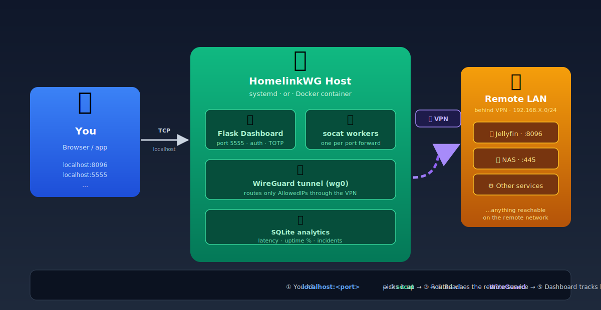

# HomelinkWG v5.0

Expose remote services (Jellyfin, NAS, etc.) sitting behind a WireGuard VPN
through local TCP ports. Ships with two deployment paths: a native
systemd install (`deploy.sh`) for Debian/Ubuntu hosts, or a single Docker
container. Both expose the same Flask dashboard for live monitoring.



## Features

- 🔐 **WireGuard VPN tunnel** managed automatically
- 🔁 **TCP port forwarding** via `socat` (one process per `ports[]` entry)
- 📊 **Flask dashboard** with live metrics, incidents log, and admin controls
- 🔑 **Admin auth** with bcrypt password hashing and optional TOTP
- 📈 **SQLite analytics** (latency, uptime %, incidents)
- 💡 **Light/Ultra-light modes** for low-power hosts (Raspberry Pi, etc.)
- 🐳 **Two deployment paths**: native systemd OR Docker — pick what fits

## Layout

```
homelinkwg/
├── deploy.sh                 Native install (systemd) — converges system to config.json
├── manage-ports.sh           Add/remove/enable/disable ports (atomic edits)
├── health-check.sh           Exit code = number of failed checks
├── dashboard.py              Flask dashboard
├── config.json(.example)     Ports, dashboard, VPN interface
├── yourconfwg/wg0.conf       Your WireGuard client config (NOT committed)
├── Dockerfile                Container image
├── docker-compose.yml        Docker deploy (Linux host)
├── docker-compose.mac-test.yml   Dashboard-only test (macOS/Windows, no VPN)
├── docker-entrypoint.sh      Container init: hash password, bring up wg0, gen supervisord conf
├── .env.example              Env vars template (Docker)
└── requirements.txt          Python deps
```

---

## Option A — Native install (systemd)

Recommended for a dedicated Debian/Ubuntu host or VM. This is the original
and most battle-tested deployment path.

### Requirements

- Debian 10+ / Ubuntu 20.04+
- Root access (for systemd + WireGuard)
- Outbound UDP to your WireGuard endpoint

`deploy.sh` installs everything else automatically: `wireguard`,
`wireguard-tools`, `openresolv`, `socat`, `python3-flask`, `bcrypt`, `jq`.

### Quick start

```bash
# 1. Drop your WireGuard client config in place
cp /path/to/your/wg0.conf yourconfwg/wg0.conf

# 2. Edit config.json (copy from the example)
cp config.json.example config.json
nano config.json   # set remote_host IPs

# 3. Run the deployer
chmod +x *.sh
sudo ./deploy.sh
```

On the first run `deploy.sh` asks whether to enable auto-boot and the
dashboard, stores the answers in `/etc/homelinkwg/settings.conf`, then
converges everything. Subsequent runs are silent and idempotent.

### Managing ports

```bash
sudo ./manage-ports.sh list
sudo ./manage-ports.sh status
sudo ./manage-ports.sh add 9000 192.168.60.210 3000 "MyService" "Description"
sudo ./manage-ports.sh remove 9000
sudo ./manage-ports.sh disable 8096   # keeps config, stops service
sudo ./manage-ports.sh enable  8096
```

All mutating commands take a file lock and re-run `deploy.sh` at the end.

### Upgrading (no clobber)

Without overwriting existing `config.json` / `wg0.conf`:
```bash
sudo ./deploy.sh --update
```

To overwrite them with the current folder's versions:
```bash
sudo ./deploy.sh --update --apply-config
```

### Reset

```bash
sudo ./deploy.sh reset
```

Stops and removes every `homelinkwg-*` systemd unit, cleans
`/etc/homelinkwg/` and `/var/log/homelinkwg-*.log`. The WireGuard config at
`/etc/wireguard/wg0.conf` and `wg-quick@wg0` are intentionally left alone —
take it down manually with `sudo wg-quick down wg0` if you want.

### Logs

```bash
journalctl -u 'homelinkwg-*' -f         # all HomelinkWG units
journalctl -u homelinkwg-socat-8096 -f  # one port
journalctl -u homelinkwg-dashboard -f   # dashboard only
tail -f /var/log/homelinkwg-deploy.log
```

### Health checks

```bash
sudo ./health-check.sh        # pretty output, exit code = #failures
sudo ./health-check.sh -q     # quiet — only failures, for cron
```

Sample cron:
```
*/5 * * * * /opt/homelinkwg/health-check.sh -q || systemctl restart 'homelinkwg-*'
```

---

## Option B — Docker

Recommended when you don't want to install anything system-wide, or when you
already run other services through Docker Compose.

### Requirements

- **Docker** + **Docker Compose v2** (`docker compose ...`)
- **Linux host** with WireGuard kernel module (Linux 5.6+ has it built-in)
  - On older kernels: `sudo apt install wireguard-dkms`

> **macOS / Windows** Docker Desktop does not expose a kernel WireGuard
> module. Use `docker-compose.mac-test.yml` to test the dashboard alone
> (no VPN tunnel).

### Quick start

```bash
# 1. Env file
cp .env.example .env
nano .env                       # set ADMIN_PASSWORD

# 2. Config
cp config.json.example config.json
nano config.json                # set remote_host IPs

# 3. WireGuard config
cp /path/to/your/wg0.conf yourconfwg/wg0.conf

# 4. Launch
docker compose up -d
docker compose logs -f homelinkwg
```

Open the dashboard at **http://localhost:5555** and log in with the
`ADMIN_PASSWORD` you set.

### Exposing forwarded ports to the host

Forwards run inside the container by default. To make one reachable from
the host, add it to `docker-compose.yml`:
```yaml
ports:
  - "5555:5555"   # dashboard
  - "8096:8096"   # Jellyfin (added)
```

### Operations

```bash
docker compose up -d
docker compose down
docker compose logs -f homelinkwg

# Restart only the dashboard process (keeps the VPN up)
docker exec homelinkwg supervisorctl restart dashboard

# Update to a new image build
git pull
docker compose build --no-cache
docker compose up -d
```

### Verifying the tunnel from inside the container

```bash
docker exec homelinkwg wg show
docker exec homelinkwg ip route
docker exec homelinkwg ping -c2 <remote_host>
docker exec homelinkwg nc -vz <remote_host> <remote_port>
```

### Local Mac/Windows test (no VPN)

Test the dashboard alone (no WireGuard needed, no `wg0.conf` needed):
```bash
docker compose -f docker-compose.mac-test.yml up --build
```

### Docker networking notes

The compose file already grants:
- `cap_add: NET_ADMIN, SYS_MODULE` — create/manage `wg0`
- `devices: /dev/net/tun` — kernel tunnel device
- `sysctls: net.ipv4.ip_forward=1` — enable IP forwarding

> **Subnet conflict warning:** If your VPN's `AllowedIPs` overlaps with your
> Docker bridge network (default `172.17.0.0/16`) or with your host LAN, the
> tunnel routes may fight Docker's. Pick non-overlapping ranges, or set a
> custom Docker subnet via `networks:` in compose.

---

## Configuration (shared)

### `config.json`

```json
{
  "ports": [
    {
      "local_port":  8096,
      "remote_host": "192.168.60.210",
      "remote_port": 8096,
      "name":        "Jellyfin",
      "description": "Media server",
      "enabled":     true
    }
  ],
  "dashboard": {
    "enabled":      true,
    "port":         5555,
    "bind_address": "0.0.0.0",
    "light_mode":   false,
    "ultra_light":  false
  },
  "vpn": {
    "interface":   "wg0",
    "config_file": "yourconfwg/wg0.conf"
  },
  "analytics": {
    "enabled": true
  }
}
```

Each entry under `ports[]` becomes a `socat` listener — either a systemd
unit (`homelinkwg-socat-<port>.service`) under Option A, or a `supervisord`
program inside the container under Option B. Both options support hot
reconfig: re-run `deploy.sh` (A) or restart the container (B) after editing.

### Environment variables (Docker only)

| Variable                | Required | Default       | Description                          |
|-------------------------|----------|---------------|--------------------------------------|
| `ADMIN_PASSWORD`        | yes¹     | —             | Plaintext, hashed at startup         |
| `ADMIN_PASSWORD_HASH`   | yes¹     | —             | Pre-computed bcrypt hash             |
| `DASHBOARD_PORT`        | no       | `5555`        | Dashboard listen port                |
| `DASHBOARD_HOST`        | no       | `0.0.0.0`     | Dashboard bind address               |
| `WG_INTERFACE`          | no       | `wg0`         | WireGuard interface name             |
| `WG_CONFIG_FILE`        | no       | `./yourconfwg/wg0.conf` | Path on host to your wg config |
| `ANALYTICS_ENABLED`     | no       | `true`        | Enable SQLite metrics collection     |
| `LIGHT_MODE`            | no       | `false`       | Reduce probe & UI refresh frequency  |
| `ULTRA_LIGHT`           | no       | `false`       | Disable charts + analytics entirely  |
| `TZ`                    | no       | `UTC`         | Timezone (e.g. `Europe/Paris`)       |
| `LOG_LEVEL`             | no       | `info`        | `debug` / `info` / `warn` / `error`  |

¹ Either `ADMIN_PASSWORD` or `ADMIN_PASSWORD_HASH` must be set.

For native install, the equivalents live in `/etc/homelinkwg/settings.conf`
(written by `deploy.sh` on first run).

### Lightweight mode

For Raspberry Pi or small VPS:
- in `config.json`: `dashboard.light_mode: true` (and optionally `ultra_light: true`)
- or in `.env` (Docker): `LIGHT_MODE=true ULTRA_LIGHT=true`

Reduces UI refresh rate, disables charts, raises status cache TTL, and trims
analytics frequency.

---

## Dashboard API

- `GET /` — main UI (login required)
- `GET /api/livez` — liveness probe (used by Docker `HEALTHCHECK`)
- `GET /api/healthz` — 200 if VPN up + all forwards healthy, else 503
- `GET /api/status` — full snapshot (admin token required)
- `GET /api/incidents` — recent incidents (admin)
- `DELETE /api/incidents/<id>` — close/dismiss an incident (admin)

---

## Troubleshooting

| Symptom | Where to look |
|---------|---------------|
| `deploy.sh` aborts on config | `jq empty config.json` to validate JSON syntax |
| WireGuard doesn't come up (native) | `sudo wg show`, `sudo journalctl -u wg-quick@wg0 -n 50`, check UDP reaches the endpoint (`nc -u -vz endpoint 51820`) |
| WireGuard DOWN in container | `docker exec homelinkwg wg show` — confirm a recent handshake; verify the host kernel has the wg module (`lsmod | grep wireguard`) |
| Container exits immediately | `docker compose logs homelinkwg` — usually a missing `ADMIN_PASSWORD` or malformed `config.json` |
| Local port not listening (native) | `sudo systemctl status homelinkwg-socat-<port>`, `ss -tlnp sport = :<port>` |
| Target unreachable | `nc -vz <remote_host> <remote_port>` — if this fails, the tunnel/routing is the problem, not socat |
| Dashboard 503 on `/api/healthz` | At least one check fails — hit `/api/status` to see which |
| `Permission denied` on iptables (Docker) | Confirm `cap_add: NET_ADMIN` is present in compose |
| Subnet/route conflicts (Docker) | `docker exec homelinkwg ip route` and check overlap with Docker's bridge |

---

## Security notes

- Native install: `deploy.sh` writes hardened systemd units
  (`NoNewPrivileges`, `ProtectSystem=strict`, `ProtectHome`, `PrivateTmp`,
  dropped capabilities — `socat` keeps only `CAP_NET_BIND_SERVICE`).
  The dashboard runs as the unprivileged `homelinkwg` system user, never root.
  `/etc/wireguard/wg0.conf` is installed mode 600 root:root.
  `config.json` is mode 640 so the dashboard user can read it.
- Docker: `supervisord` runs as root inside the container (required for
  `wg-quick`), but the container is isolated from the host and capabilities
  are dropped to the minimum (`NET_ADMIN`, `SYS_MODULE`).
- Passwords are hashed with `bcrypt` at startup; the plaintext is wiped
  from memory immediately after.
- Optional **TOTP 2FA** can be enabled from the dashboard's Settings tab.
- **Never commit** `yourconfwg/wg0.conf`, `config.json`, or `.env` —
  they contain VPN private keys, internal IPs, and admin credentials.
  All three are excluded by `.gitignore`.
